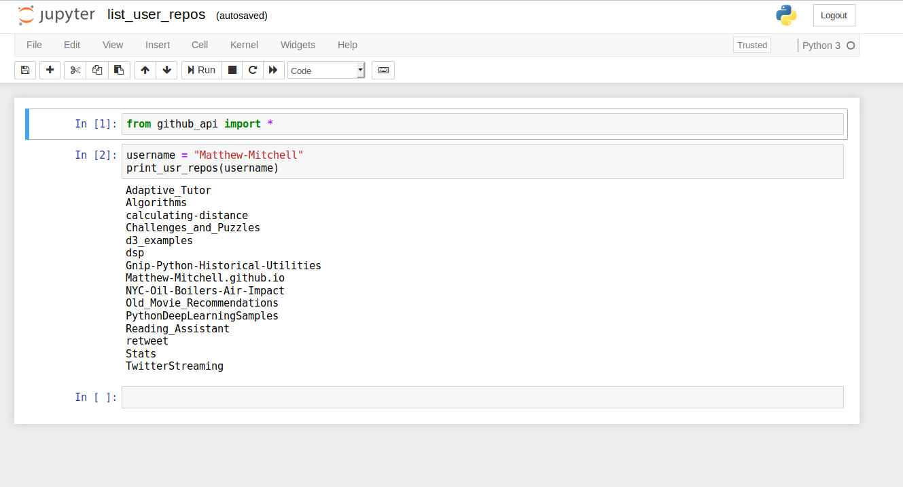

Welcome to the list_user_repos documentation!

## Basic Usage

### Jupyter Notebook Usage
You'll find simple streamlined python tools for printing a user's github repositories here. To run the script, open list_user_repos.ipynb using jupyter notebook. 

You should see a page that looks like this:



Load the necessary dependencies by running the cell with `shift + enter`.   
Modify the username string to the username of your choice and press shift+enter to execute the script.  
> Note: This cell can be rerun with alternative users.

### Command Line Usage

Alternatively, you can run this package from the command line with

```python list_user_repos.py "Matthew-Mitchell"```

Here, "Matthew-Mitchell" is the username you wish to print the repositories for. Replace "Matthew-Mitchell" with an alternative username, as desired.

## Additional Notes

Please note that the current version of the script does not authenticate the user. This leads to more stringent API rate limiting. At present, you will only be able to make 60 requests per minute with each request returning 30 repository names. If you are querying a user with a large number of repositories, this may take some time to complete. Of course, you can always terminate the process if you desire.
